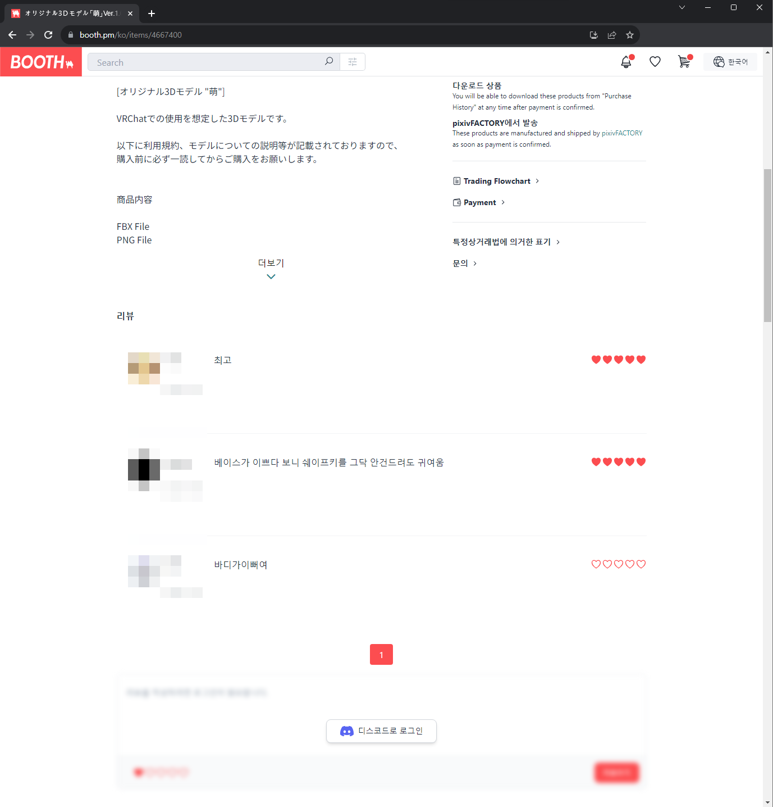
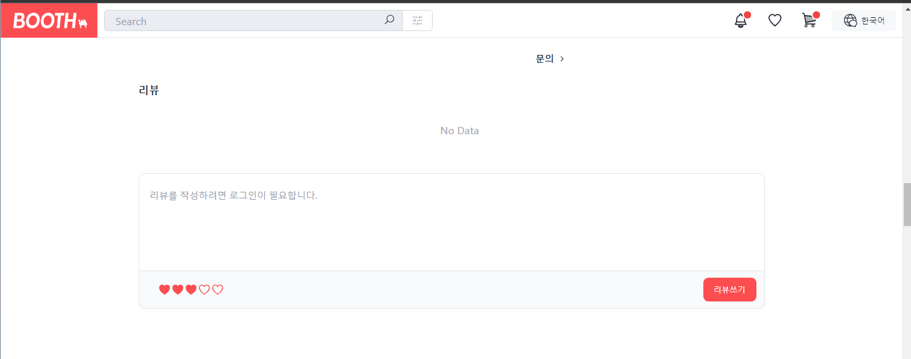

# BoothPlus

# 요약

부스(booth.pm) 사이트에 상품을 구매할 때 리뷰 확인하고 현명한 소비를 하고 싶은 생각에 만든 크롬 확장프로그램입니다.
카뮤님의 부스 리뷰 사이트(vrc-booth.com)의 리뷰들을 활용해 부스 하단에 리뷰 창을 띄워주는 기능이 있으며
디스코드 OAuth 2.0 사용해서 인증을 통해 사용자 관리를 하고 있습니다.

# 적용 이미지

  
  

