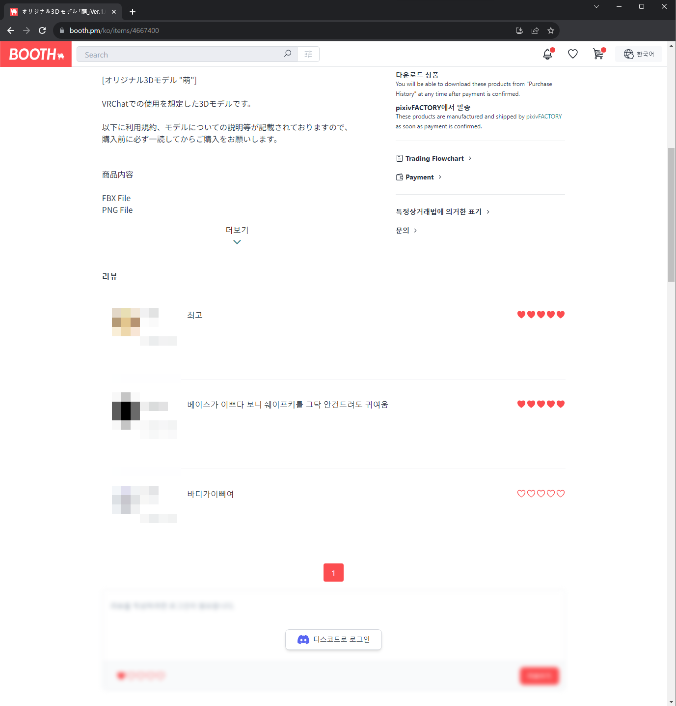
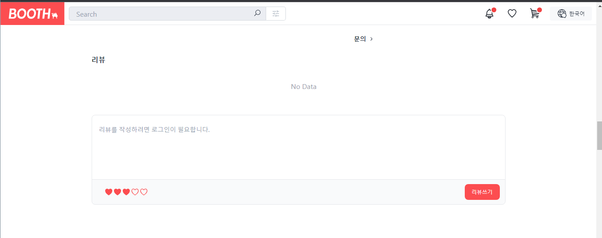

# BoothPlus

# 요약

부스(booth.pm) 사이트에 상품을 구매할 때 리뷰 확인하고 현명한 소비를 하고 싶은 생각에 만든 크롬 확장프로그램입니다.
카뮤님의 부스 리뷰 사이트(vrc-booth.com)의 리뷰들을 활용해 부스 하단에 리뷰 창을 띄워주는 기능이 있으며
디스코드 OAuth 2.0 사용해서 인증을 통해 사용자 관리를 하고 있습니다.

# 적용 이미지

<p style="align-content: center">
  
  
</p>

## 개발 및 검증

Bun 1.4.2와 Node.js 24.19.0을 사용합니다. Bun 버전은 `package.json`의 `packageManager`에 고정되어 있습니다. [Bun 설치 방법](https://bun.sh/docs/installation)을 참고하세요.

```bash
bun install --frozen-lockfile
bun run test
bun run compile
bun run build
bun run build:firefox
```

Bun은 의존성 설치와 스크립트 실행에 사용하며, WXT·Vite·Vitest는 기존 Node.js 런타임을 유지합니다. `bun test` / `bun build`는 다른 내장 명령이므로 반드시 `bun run test` / `bun run build`를 사용하세요. 기존 체크아웃에서 전환할 때는 생성된 `node_modules`를 지운 뒤 위 설치 명령을 실행합니다.

개발 서버는 `bun run dev` / `bun run dev:firefox`, 미리보기는 `bun run preview`로 시작합니다. `bun run check`는 단위 검사·타입 검사·양쪽 브라우저 빌드를 실행합니다.

Chrome 빌드는 `dist/chrome-mv3`, Firefox 빌드는 `dist/firefox-mv2`에 생성됩니다.

### 백엔드 호환성

[백엔드의 레거시 확장 계약](https://github.com/vrc-booth/vrc-booth/blob/a4302ff89708f7649667e368834f2110304b8676/docs/web-api/legacy-extension-compat.md)을 기준으로 기존 `/api` 경로와 1 기반 페이지 번호를 유지합니다. `/api/v2`로 경로만 바꾸면 응답 구조가 달라지므로 별도 마이그레이션이 필요합니다.

- 실제 저장되는 사용자명과 리뷰 작성·수정·삭제를 유지합니다. 리뷰는 500자까지 입력할 수 있습니다.
- 저장되지 않는 투표·성인 콘텐츠·자동 접기·아바타 숨김·자기소개 설정은 조작 화면에서 제거했습니다.
- 신규 사용자가 사용자명을 설정해야 리뷰를 쓸 수 있으므로 계정 설정 진입점을 제공합니다.
- 삭제 완료를 기다린 후 목록과 상품 집계를 새로 읽고, 서버 오류를 호출자에 전달합니다.
- 회전형 refresh token은 백그라운드에서 공유하고 동시 갱신을 합칩니다. 로그인·로그아웃과 갱신 결과 저장을 직렬화하며, 다른 로그인 세션으로 요청을 재전송하지 않습니다.
- Discord 취소·실패·잘못된 응답은 토큰으로 저장하지 않으며 OAuth state와 반환 주소를 검증합니다.

구매 영역 요약 칩 PR #29는 최신 dev의 1cf74c4712f77e8c832b6fc4d7f20aa7dd855516에 이미 병합되었습니다. 이번 변경은 그 기준에 호환성 패치를 통합하며 공용 캐시·칩 위치·닫기 상태를 유지합니다. 인증 헬퍼는 백그라운드 경유 반환 주소와 세션 보호 구현으로 통합했습니다.

### 검사 범위

단위 검사는 요청 계약, 삭제 실패 전파, 토큰 갱신·로그아웃 경합, 로그인 콜백을 확인합니다. UI 구조 검사는 제거된 컨트롤과 입력 제한을 확인하며 실제 브라우저 상호작용 검사를 대체하지 않습니다.

배포 전에는 개발자 모드에서 빌드된 확장을 로드해 BOOTH 본 도메인과 상점 서브도메인에서 확인해야 합니다. 실제 Discord 로그인·취소, 다중 탭 만료 토큰, 계정 설정 열기, 테스트 계정의 리뷰 작성·수정·삭제는 별도 통합 검사가 필요합니다. 운영 리뷰·계정 설정을 검사 목적으로 변경하지 마세요.

추가 상호작용·세션·DOM 수명주기 검증과 실제 브라우저 확인 범위는 [2026-10-07 QA 보고서](docs/qa-2026-10-07.md)에 기록했습니다. 테스트 DOM은 happy-dom이며 설치된 확장 검증과 구분합니다.

3.3.0은 미배포 검토 후보입니다. [릴리스 준비·차단 조건·복구 절차](docs/release/README.md)와 [변경 기록](CHANGELOG.md)을 확인하세요.

Chrome 전용 배포 자동화 코드는 [별도 승인·기본 비활성](docs/release/chrome-web-store.md) 상태입니다. 실제 설치 QA와 게시자 설정 없이는 제출하지 않으며, 동결된 artifact를 그대로 승격합니다.
